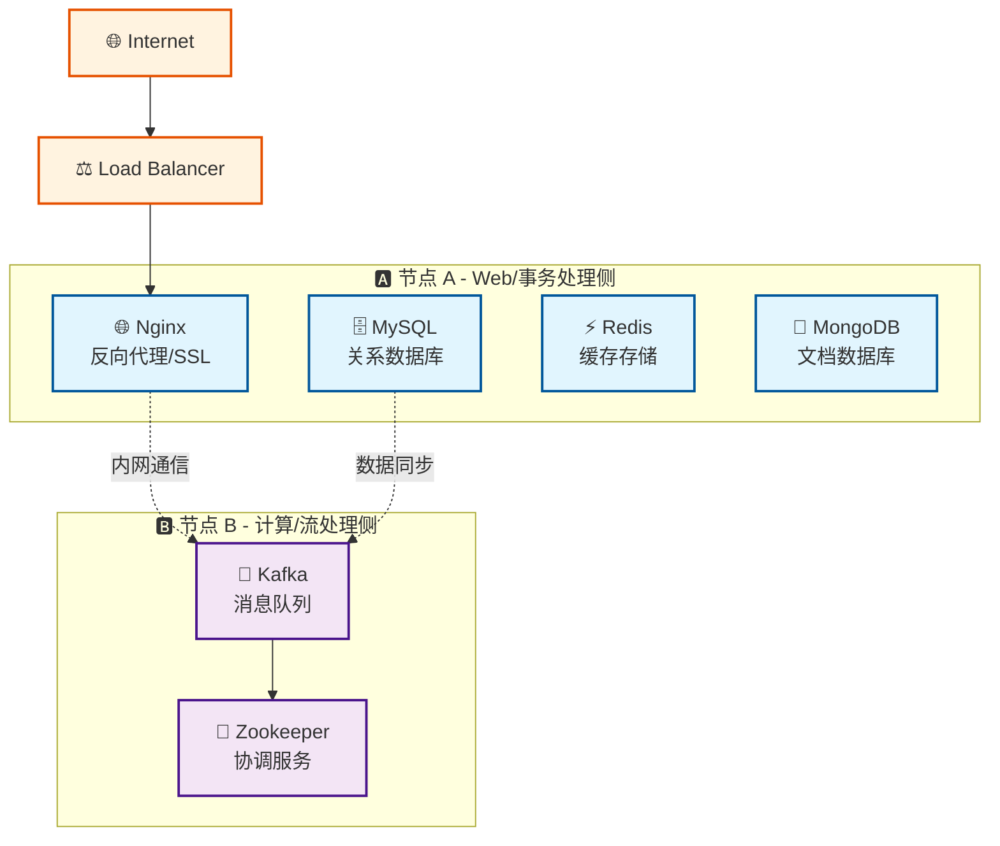

# 🏗️ 基础设施项目

组件化的基础设施服务项目，提供双节点分布式架构的 Docker Compose 编排。专注于核心基础服务：Nginx、MySQL、Redis、MongoDB、Kafka，采用组件化设计，方便扩展和维护。

## 核心特性

- **🧩 组件化架构**：每个服务独立配置，清晰的组件边界
- **⚡ 双节点部署**：Web/事务侧 + 计算/流处理侧分布式架构
- **🚀 自动化部署**：完整的部署脚本和健康检查
- **🔒 生产就绪**：资源限制、健康检查、数据持久化

## 架构概览



## 服务清单

| 服务 | 节点 | 端口 | 用途 | 资源限制 |
|------|------|------|------|----------|
| **Nginx** | A | 80, 443 | 反向代理/SSL终结 | 512MB |
| **MySQL** | A | 3306 | 关系型数据库 | 1GB |
| **Redis** | A | 6379 | 缓存/会话存储 | 512MB |
| **MongoDB** | A | 27017 | 文档数据库 | 1GB |
| **Kafka** | B | 9092 | 消息队列 | 1GB |
| **Zookeeper** | B | 2181 | 集群协调 | 512MB |

## 部署要求

- Docker >= 20.x 和 Docker Compose
- Linux 系统（推荐 Ubuntu/CentOS）
- 足够的磁盘空间用于数据存储

## 快速开始

### 1. 克隆代码

```bash
git clone <repo-url> infra && cd infra
```

### 2. 节点 A 部署 (Web/事务侧)

```bash
make init-node-a
vim compose/env/prod/.env
./scripts/deploy_a.sh
```

### 3. 节点 B 部署 (计算/流处理侧)

```bash
make init-node-b
vim compose/env/prod/.env
./scripts/deploy_b.sh
```

### 4. 验证部署

```bash
make status         # 查看服务状态
make logs          # 查看日志
make config-validate  # 验证配置
```

## 环境配置

复制环境变量模板并修改：

```bash
cp compose/env/prod/.env.example compose/env/prod/.env
vim compose/env/prod/.env
```

主要配置项：

- `MYSQL_ROOT_PASSWORD` - MySQL root 密码
- `REDIS_PASSWORD` - Redis 密码  
- `MONGO_INITDB_ROOT_PASSWORD` - MongoDB 密码
- `NODE_A_IP` / `NODE_B_IP` - 节点 IP 地址

## 项目结构

```text
├── compose/          # Docker Compose 配置
├── components/       # 组件配置文件  
├── scripts/         # 部署脚本
├── logs/           # 日志目录
└── Makefile        # 管理命令
```

## 管理命令

```bash
make help          # 查看帮助
make status        # 查看状态
make logs          # 查看日志
make down          # 停止服务
make clean         # 清理资源
```

---

更多详情请参考 [QUICKSTART.md](./QUICKSTART.md)
