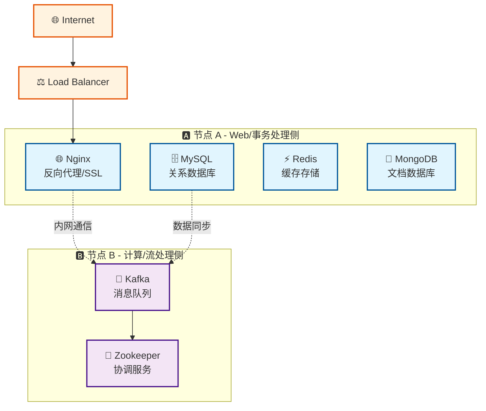

# 🏗️ 基础设施项目

组件化的基础设施服务项目，提供双节点分布式架构的 Docker Compose 编排。专注于核心基础服务：Nginx、MySQL、Redis、MongoDB、Kafka，采用组件化设计，方便扩展和维护。

## 核心特性

- **🧩 组件化架构**：每个服务独立配置，清晰的组件边界
- **⚡ 双节点部署**：Web/事务侧 + 计算/流处理侧分布式架构
- **🚀 自动化部署**：完整的部署脚本和健康检查
- **🔒 生产就绪**：资源限制、健康检查、数据持久化

## 架构概览



## 服务清单

| 服务 | 节点 | 端口 | 用途 | 资源限制 |
|------|------|------|------|----------|
| **Nginx** | A | 80, 443 | 反向代理/SSL终结 | 512MB |
| **MySQL** | A | 3306 | 关系型数据库 | 1GB |
| **Redis** | A | 6379 | 缓存/会话存储 | 512MB |
| **MongoDB** | A | 27017 | 文档数据库 | 1GB |
| **Kafka** | B | 9092 | 消息队列 | 1GB |
| **Zookeeper** | B | 2181 | 集群协调 | 512MB |

## 部署要求

- Docker >= 20.x 和 Docker Compose
- Linux 系统（推荐 Ubuntu/CentOS）
- 足够的磁盘空间用于数据存储

## 快速开始

### 1. 克隆代码

```bash
git clone <repo-url> infra && cd infra
```

### 2. 节点 A 部署 (Web/事务侧)

```bash
make init-node-a
vim compose/env/prod/.env
./scripts/deploy_a.sh
```

### 3. 节点 B 部署 (计算/流处理侧)

```bash
make init-node-b
vim compose/env/prod/.env
./scripts/deploy_b.sh
```

### 4. 初始化网络环境（可选）

配置 VPN 代理以优化网络访问：

```bash
sudo ./scripts/setup-network.sh
```

### 5. 验证部署

```bash
make status         # 查看服务状态
make logs          # 查看日志
make config-validate  # 验证配置
```

## 环境配置

复制环境变量模板并修改：

```bash
cp compose/env/prod/.env.example compose/env/prod/.env
vim compose/env/prod/.env
```

主要配置项：

- `MYSQL_ROOT_PASSWORD` - MySQL root 密码
- `REDIS_PASSWORD` - Redis 密码  
- `MONGO_INITDB_ROOT_PASSWORD` - MongoDB 密码
- `NODE_A_IP` / `NODE_B_IP` - 节点 IP 地址

## 项目结构

```text
├── compose/              # Docker Compose 配置
├── components/           # 组件配置文件  
├── scripts/             # 自动化脚本
│   ├── init-server/     # 服务器初始化脚本
│   │   ├── init-users.sh        # 用户环境初始化
│   │   ├── install-docker.sh    # Docker 安装
│   │   ├── setup-network.sh     # 网络环境配置
│   │   ├── diagnose-network.sh  # 网络环境诊断
│   │   └── update-static-files.sh # 静态文件更新
│   └── deploy/          # 应用部署脚本
├── static/              # 静态资源文件
│   ├── geosite.dat      # 域名分流规则数据库
│   └── geoip.metadb     # IP地理位置数据库
├── logs/               # 日志目录
└── Makefile            # 管理命令
```

## 自动化脚本

项目提供完整的服务器初始化脚本：

```bash
# 1. 安装 Docker 环境
sudo ./scripts/init-server/install-docker.sh

# 2. 初始化用户环境
sudo ./scripts/init-server/init-users.sh

# 3. 配置网络环境（VPN）- 自动使用静态文件
sudo ./scripts/init-server/setup-network.sh

# 4. 故障诊断（如遇问题）
sudo ./scripts/init-server/diagnose-network.sh

# 5. 更新静态文件（可选）
./scripts/init-server/update-static-files.sh
```

## 管理命令

```bash
make help          # 查看帮助
make status        # 查看状态
make logs          # 查看日志
make down          # 停止服务
make clean         # 清理资源

# VPN 管理命令
mihomo-control start|stop|restart|status|logs
mihomo-update      # 更新订阅配置
```

## 内网环境部署

本项目完全支持无外网连接的内网环境部署：

### 特性支持

- ✅ **自动检测内网环境**：脚本会自动识别是否处于内网环境
- ✅ **依赖包离线安装**：支持跳过外网依赖，使用本地包管理
- ✅ **Docker镜像预加载**：支持预先导入的镜像，无需在线拉取
- ✅ **地理数据文件替代**：提供基础规则配置替代在线数据文件
- ✅ **配置文件手动部署**：支持离线配置文件部署

### 内网部署指南

详细的内网环境安装指南请参考：**[INTRANET_SETUP_GUIDE.md](./INTRANET_SETUP_GUIDE.md)**

### 快速内网部署

#### 方案1：使用本地静态文件（推荐）

```bash
# 1. 在有网络的机器上更新静态文件
./scripts/update-static-files.sh

# 2. 传输整个项目到内网服务器（包含 static/ 目录）

# 3. 在内网服务器上运行（脚本自动使用静态文件）
sudo ./scripts/init-server/setup-network.sh
```

#### 方案2：传统离线部署

```bash
# 1. 预先准备资源（在有网络的机器上）
# - Docker 镜像：docker save metacubex/mihomo:latest > mihomo.tar
# - 地理数据：下载 GeoSite.dat 和 GeoIP.metadb
# - 配置文件：下载订阅配置文件

# 2. 传输资源到内网服务器

# 3. 导入镜像
docker load < mihomo.tar

# 4. 运行安装脚本（自动检测内网环境）
sudo ./scripts/init-server/setup-network.sh
```

---

更多详情请参考 [QUICKSTART.md](./QUICKSTART.md)
